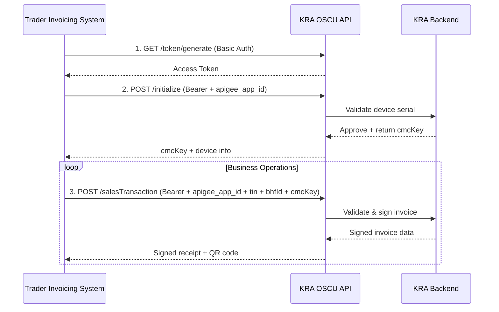

# KRA eTIMS OSCU Integration SDK


A production-ready PHP SDK for integrating with the Kenya Revenue Authority (KRA) **eTIMS OSCU** (Online Sales Control Unit) API. Built to match the official Postman collection specifications with strict header compliance, token management, and comprehensive validation.

> ⚠️ **Critical Note**: This SDK implements the **new OSCU specification** (hosted on KRA servers), *not* the legacy eTIMS API. OSCU requires device registration, `apigee_app_id` headers, and `cmcKey` lifecycle management.

## Author

**Bartile Emmanuel**  
📧 ebartile@gmail.com | 📱 +254757807150  
*Lead Developer, Paybill Kenya*

---

## Table of Contents

- [Introduction to eTIMS OSCU](#introduction-to-etims-oscu)
- [Critical Requirements](#critical-requirements)
- [Features](#features)
- [Installation](#installation)
- [Configuration](#configuration)
- [Usage Guide](#usage-guide)
- [API Reference](#api-reference)
- [Error Handling](#error-handling)
- [Troubleshooting](#troubleshooting)
- [Testing](#testing)
- [Sandbox Setup Guide](#sandbox-setup-guide)
- [Support](#support)
- [License](#license)

---

## Introduction to eTIMS OSCU

KRA's **Electronic Tax Invoice Management System (eTIMS)** now uses **OSCU** (Online Sales Control Unit) – a KRA-hosted software module that validates and signs tax invoices in real-time before issuance. Unlike legacy systems, OSCU requires:

- Pre-registered device serial numbers (`dvcSrlNo`)
- APigee-based authentication (`apigee_app_id` header)
- Communication key (`cmcKey`) lifecycle management
- Strict payload schema compliance per KRA specifications

### OSCU vs Legacy eTIMS

| Feature | OSCU (This SDK) | Legacy eTIMS |
|---------|-----------------|--------------|
| **Hosting** | KRA-hosted (cloud) | Self-hosted (on-premise) |
| **Device Registration** | Mandatory pre-registration | Not required |
| **Authentication** | Bearer token + `apigee_app_id` | Basic auth only |
| **Communication Key** | `cmcKey` required after init | Not applicable |
| **API Base URL** | `sbx.kra.go.ke/etims-oscu/api/v1` | `etims-api-sbx.kra.go.ke` |
| **Header Requirements** | Strict 6-header compliance | Minimal headers |

### Data Flow



---

## Critical Requirements

Before integration, you **MUST** complete these prerequisites:

### 1. Device Registration (MANDATORY)
- Register your OSCU device via the [eTIMS Taxpayer Sandbox Portal](https://sbx.kra.go.ke)
- Obtain an **approved device serial number** (`dvcSrlNo`)
- ⚠️ **Dynamic/unregistered device serials will fail with `resultCd: 901`** ("It is not valid device")

### 2. APigee Credentials
- Request `apigee_app_id` from KRA support (`timsupport@kra.go.ke`)
- Required in **ALL requests** (including initialization)

### 3. Communication Key Lifecycle
```php
// 1. Initialize FIRST (returns cmcKey)
$response = $client->initialize([...]);
$cmcKey = $response['cmcKey'];

// 2. Update config with cmcKey
$config['oscu']['cmc_key'] = $cmcKey;

// 3. Recreate client with updated config
$client = new EtimsClient($config, $auth);

// 4. ALL subsequent requests require cmcKey in headers
$client->selectCodeList([...]);
```

---

## Features

✅ **Postman Collection Compliance**  
- 100% header, path, and payload alignment with official KRA Postman collection  
- Correct nested paths (`/insert/stockIO`, `/save/stockMaster`)  

✅ **Strict Header Management**  
- Automatic `apigee_app_id` injection in all requests  
- Initialization uses **ONLY** `apigee_app_id` header (no `tin`/`bhfId`/`cmcKey`)  
- Business endpoints use full 6-header set  

✅ **Token Lifecycle Management**  
- Automatic token caching with 60-second buffer  
- Transparent token refresh on 401 errors  
- File-based cache with configurable location  

✅ **Comprehensive Validation**  
- Respect\Validation schemas matching KRA specifications  
- Field-level validation with human-readable errors  
- Date format enforcement (`YYYYMMDDHHmmss`)  

✅ **Error Handling**  
- Typed exceptions (`ApiException`, `AuthenticationException`, `ValidationException`)  
- `resultCd` parsing with business error messages  
- Detailed debug output for KRA fault strings  

✅ **Production Ready**  
- SSL verification enabled by default  
- Timeout configuration  
- Environment-aware (sandbox/production)  

---

## Installation

```bash
composer require paybilldev/kra-etims-sdk
```

### Requirements
- PHP 8.1+
- cURL extension
- JSON extension
- Respect\Validation (`composer require respect/validation`)

---

## Configuration

### Option 1: PHP Config Array

```php
<?php
$config = [
    'env' => 'sbx', // 'sbx' for sandbox, 'prod' for production

    'cache_file' => sys_get_temp_dir() . '/kra_etims_token.json',

    'auth' => [
        'sbx' => [
            'token_url'      => 'https://sbx.kra.go.ke/v1/token/generate',
            'consumer_key'   => getenv('KRA_CONSUMER_KEY'),
            'consumer_secret'=> getenv('KRA_CONSUMER_SECRET'),
        ],
        'prod' => [
            'token_url'      => 'https://kra.go.ke/v1/token/generate',
            'consumer_key'   => getenv('KRA_PROD_CONSUMER_KEY'),
            'consumer_secret'=> getenv('KRA_PROD_CONSUMER_SECRET'),
        ],
    ],

    'api' => [
        'sbx' => [
            'base_url'      => 'https://sbx.kra.go.ke/etims-oscu/api/v1',
            'apigee_app_id' => getenv('KRA_APIGEE_APP_ID'), // 🔑 CRITICAL
        ],
        'prod' => [
            'base_url'      => 'https://kra.go.ke/etims-oscu/api/v1',
            'apigee_app_id' => getenv('KRA_PROD_APIGEE_APP_ID'),
        ],
    ],

    'http' => [
        'timeout' => 30,
    ],

    'oscu' => [
        'tin'     => getenv('KRA_TIN'),
        'bhf_id'  => getenv('KRA_BHF_ID'),
        'cmc_key' => '', // Set AFTER initialization
    ],

    'endpoints' => [
        // INITIALIZATION
        'initialize' => '/initialize',

        // DATA MANAGEMENT
        'selectCodeList'     => '/selectCodeList',
        'selectItemClass'    => '/selectItemClass',
        'branchList'         => '/branchList',
        'selectTaxpayerInfo' => '/selectTaxpayerInfo',
        'selectCustomerList' => '/selectCustomerList',
        'selectNoticeList'   => '/selectNoticeList',

        // SALES MANAGEMENT
        'sendSalesTransaction'   => '/sendSalesTransaction',
        'selectSalesTransactions'=> '/selectSalesTransactions',
        'selectInvoiceDetail'    => '/selectInvoiceDetail',

        // STOCK MANAGEMENT
        'insertStockIO'        => '/insert/stockIO',
        'saveStockMaster'      => '/save/stockMaster',
        'selectStockMoveLists' => '/selectStockMoveLists',

        // PURCHASE MANAGEMENT
        'getPurchaseTransactionInfo'  => '/getPurchaseTransactionInfo',
        'sendPurchaseTransactionInfo' => '/sendPurchaseTransactionInfo',

        // ITEM MANAGEMENT
        'saveItem'            => '/saveItem',
        'itemInfo'            => '/itemInfo',
        'saveItemComposition' => '/saveItemComposition',
    ],
];
```

---

## Usage Guide

### Step 1: Initialize SDK

```php
<?php
require_once __DIR__ . '/vendor/autoload.php';

use KraEtimsSdk\Services\AuthClient;
use KraEtimsSdk\Services\EtimsClient;

// Load config (see Configuration section above)
$config = require __DIR__ . '/config.php';

// Bootstrap clients
$auth = new AuthClient($config);
$client = new EtimsClient($config, $auth);
```

### Step 2: Authenticate (Get Access Token)

```php
try {
    // Force fresh token (optional - cache used by default)
    $token = $auth->token(true);
    echo "✅ Token acquired: " . substr($token, 0, 20) . "...\n";
} catch (\Throwable $e) {
    echo "❌ Authentication failed: " . $e->getMessage() . "\n";
    exit(1);
}
```

### Step 3: OSCU Initialization (Critical Step)

```php
try {
    // ⚠️ MUST use KRA-approved device serial (NOT dynamic!)
    $response = $client->initialize([
        'tin'      => $config['oscu']['tin'],
        'bhfId'    => $config['oscu']['bhf_id'],
        'dvcSrlNo' => 'dvcv1130', // REPLACE with your approved serial
    ]);

    // Extract cmcKey (returned at root level in sandbox)
    $cmcKey = $response['cmcKey'] ?? null;
    
    if (!$cmcKey) {
        throw new \RuntimeException('cmcKey not found in response');
    }

    // Update config with cmcKey
    $config['oscu']['cmc_key'] = $cmcKey;
    
    // Recreate client with updated config
    $client = new EtimsClient($config, $auth);
    
    echo "✅ OSCU initialized. cmcKey: " . substr($cmcKey, 0, 15) . "...\n";
} catch (\KraEtimsSdk\Exceptions\ApiException $e) {
    if ($e->getErrorCode() === '901') {
        echo "❌ DEVICE NOT VALID (resultCd 901)\n";
        echo "   → Device serial not registered with KRA\n";
        echo "   → Contact timsupport@kra.go.ke for approved serial\n";
    }
    exit(1);
}
```

### Step 4: Business Operations

```php
// Fetch code list
try {
    $codes = $client->selectCodeList([
        'tin'       => $config['oscu']['tin'],
        'bhfId'     => $config['oscu']['bhf_id'],
        'lastReqDt' => date('YmdHis', strtotime('-7 days')),
    ]);
    echo "✅ Retrieved " . count($codes['itemList'] ?? []) . " codes\n";
} catch (\Throwable $e) {
    echo "❌ Code list fetch failed: " . $e->getMessage() . "\n";
}

// Send sales transaction (Postman-compliant payload)
try {
    $response = $client->sendSalesTransaction([
        'invcNo'        => 1, // INTEGER (sequential)
        'custTin'       => 'A123456789Z',
        'custNm'        => 'Test Customer',
        'salesTyCd'     => 'N', // N=Normal, R=Return
        'rcptTyCd'      => 'R', // R=Receipt
        'pmtTyCd'       => '01', // 01=Cash
        'salesSttsCd'   => '01', // 01=Completed
        'cfmDt'         => date('YmdHis'),
        'salesDt'       => date('Ymd'),
        'stockRlsDt'    => date('YmdHis'),
        'totItemCnt'    => 1,
        'taxblAmtA'     => 0.00,
        'taxblAmtB'     => 0.00,
        'taxblAmtC'     => 81000.00,
        'taxblAmtD'     => 0.00,
        'taxblAmtE'     => 0.00,
        'taxRtA'        => 0.00,
        'taxRtB'        => 0.00,
        'taxRtC'        => 0.00,
        'taxRtD'        => 0.00,
        'taxRtE'        => 0.00,
        'taxAmtA'       => 0.00,
        'taxAmtB'       => 0.00,
        'taxAmtC'       => 0.00,
        'taxAmtD'       => 0.00,
        'taxAmtE'       => 0.00,
        'totTaxblAmt'   => 81000.00,
        'totTaxAmt'     => 0.00,
        'totAmt'        => 81000.00,
        'prchrAcptcYn'  => 'N',
        'regrId'        => 'Admin',
        'regrNm'        => 'Admin',
        'modrId'        => 'Admin',
        'modrNm'        => 'Admin',
        'receipt' => [
            'custTin'    => 'A123456789Z',
            'custMblNo'  => null,
            'rptNo'      => 1,
            'rcptPbctDt' => date('YmdHis'),
            'trdeNm'     => '',
            'adrs'       => '',
            'topMsg'     => 'Shopwithus',
            'btmMsg'     => 'Welcome',
            'prchrAcptcYn' => 'N',
        ],
        'itemList' => [
            [
                'itemSeq'   => 1,
                'itemCd'    => 'KE2NTBA00000001',
                'itemClsCd' => '1000000000',
                'itemNm'    => 'Brand A',
                'barCd'     => '',
                'pkgUnitCd' => 'NT',
                'pkg'       => 1,
                'qtyUnitCd' => 'BA',
                'qty'       => 90.0,
                'prc'       => 1000.00,
                'splyAmt'   => 81000.00,
                'dcRt'      => 10.0,
                'dcAmt'     => 9000.00,
                'taxTyCd'   => 'C',
                'taxblAmt'  => 81000.00,
                'taxAmt'    => 0.00,
                'totAmt'    => 81000.00,
            ],
        ],
    ]);
    
    echo "✅ Sales transaction sent (resultCd: {$response['resultCd']})\n";
} catch (\Throwable $e) {
    echo "❌ Sales transaction failed: " . $e->getMessage() . "\n";
}
```

---

## API Reference

### Core Classes

| Class | Purpose |
|-------|---------|
| `AuthClient` | Token generation, caching, and refresh management |
| `BaseClient` | HTTP request handling, header management, error unwrapping |
| `EtimsClient` | Business endpoint methods (sales, stock, purchases) |
| `Validator` | Payload validation against KRA schemas |

### Endpoint Methods

#### Initialization
```php
initialize(array $data): array
// Required fields: tin, bhfId, dvcSrlNo
// Returns: cmcKey + device info
```

#### Data Management
```php
selectCodeList(array $data): array
selectItemClass(array $data): array
branchList(array $data): array
selectTaxpayerInfo(array $data): array
selectCustomerList(array $data): array
selectNoticeList(array $data): array
```

#### Sales Management
```php
sendSalesTransaction(array $data): array
selectSalesTransactions(array $data): array
selectInvoiceDetail(array $data): array
```

#### Stock Management
```php
insertStockIO(array $data): array      // Note: nested path /insert/stockIO
saveStockMaster(array $data): array    // Note: nested path /save/stockMaster
selectStockMoveLists(array $data): array
```

#### Purchase Management
```php
getPurchaseTransactionInfo(array $data): array
sendPurchaseTransactionInfo(array $data): array
```

#### Item Management
```php
saveItem(array $data): array
itemInfo(array $data): array
saveItemComposition(array $data): array
```

---

## Error Handling

### Exception Types

| Exception | When Thrown | Example |
|-----------|-------------|---------|
| `AuthenticationException` | Token generation fails | Invalid consumer key/secret |
| `ApiException` | KRA business error (`resultCd !== '0000'`) | `resultCd: 500` (invalid payload) |
| `ValidationException` | Payload fails schema validation | Missing required field |

### Handling Pattern

```php
try {
    $response = $client->sendSalesTransaction($payload);
} catch (\KraEtimsSdk\Exceptions\ValidationException $e) {
    foreach ($e->getErrors() as $error) {
        echo "Validation error: $error\n";
    }
} catch (\KraEtimsSdk\Exceptions\ApiException $e) {
    echo "KRA API Error ({$e->getErrorCode()}): {$e->getMessage()}\n";
    print_r($e->getDetails()); // Full KRA response
} catch (\KraEtimsSdk\Exceptions\AuthenticationException $e) {
    echo "Authentication failed: {$e->getMessage()}\n";
} catch (\Throwable $e) {
    echo "Unexpected error: {$e->getMessage()}\n";
}
```

### Common KRA Error Codes

| Code | Meaning | Solution |
|------|---------|----------|
| `901` | "It is not valid device" | Use KRA-approved device serial |
| `902` | "Invalid cmcKey" | Re-initialize OSCU to get fresh cmcKey |
| `500` | "Check request body" | Validate payload against Postman schema |
| `401` | "Unauthorized" | Check token validity + apigee_app_id header |

---

## Troubleshooting

### ❌ "It is not valid device" (resultCd: 901)

**Cause**: Device serial not registered with KRA sandbox  
**Solution**:
1. Email `timsupport@kra.go.ke` requesting approved sandbox credentials
2. Use **static** approved serial (e.g., `dvcv1130`) – never generate dynamically
3. Verify TIN/branch ID match registered device

### ❌ "Invalid cmcKey" (resultCd: 902)

**Cause**: cmcKey expired or not set in config  
**Solution**:
```php
// After initialization:
$config['oscu']['cmc_key'] = $response['cmcKey'];
$client = new EtimsClient($config, $auth); // MUST recreate client
```

### ❌ Missing apigee_app_id header

**Cause**: `apigee_app_id` not set in config  
**Solution**:
```php
'api' => [
    'sbx' => [
        'apigee_app_id' => 'YOUR_APIGEE_APP_ID', // 🔑 REQUIRED
    ],
],
```

### ❌ Trailing spaces in URLs

**Cause**: Copy-paste errors from documentation  
**Solution**: Use `trim()` on all URLs in config:
```php
'token_url' => trim('https://sbx.kra.go.ke/v1/token/generate'),
```

---

## Testing

### Run Integration Tests

```bash
# Set environment variables first
export KRA_CONSUMER_KEY="your_key"
export KRA_CONSUMER_SECRET="your_secret"
export KRA_APIGEE_APP_ID="your_apigee_id"
export KRA_TIN="P051092286D"
export KRA_BHF_ID="00"

# Run test suite
php examples/test_integration.php
```

### Test Flow Validation

The test suite validates:
1. ✅ Token generation with Basic Auth
2. ✅ OSCU initialization with approved device serial
3. ✅ cmcKey extraction and header injection
4. ✅ Code list retrieval
5. ✅ Sales transaction with full Postman payload
6. ✅ Token cache reuse

---

## Sandbox Setup Guide

### Step 1: Register on eTIMS Portal
1. Visit [eTIMS Taxpayer Sandbox Portal](https://sbx.kra.go.ke)
2. Sign up with your company PIN
3. Request OSCU device registration via "Service Request" → "eTIMS" → "OSCU"

### Step 2: Obtain Credentials
After approval, KRA will provide:
- Approved device serial number (`dvcSrlNo`)
- Sandbox TIN and branch ID
- APigee App ID (`apigee_app_id`)
- Consumer key/secret for token generation

### Step 3: Configure SDK
```env
KRA_CONSUMER_KEY="provided_by_kra"
KRA_CONSUMER_SECRET="provided_by_kra"
KRA_APIGEE_APP_ID="provided_by_kra"
KRA_TIN="provided_by_kra"
KRA_BHF_ID="00"
KRA_ENV="sbx"
```

### Step 4: Run Initialization Test
```bash
php examples/test_initialization.php
```

> 💡 **Sandbox Tip**: Use device serial `dvcv1130` for initial testing – KRA has pre-provisioned this in sandbox (may not work in production).

---

## Support

### KRA Official Support
| Purpose | Contact | Response Time |
|---------|---------|---------------|
| Sandbox credentials | `timsupport@kra.go.ke` | 1-3 business days |
| API technical issues | `apisupport@kra.go.ke` | 24-48 hours |
| Portal access issues | `timsupport@kra.go.ke` | 1 business day |

### SDK Support
For SDK-specific issues:
- GitHub Issues: [github.com/paybilldev/kra-etims-sdk/issues](https://github.com/paybilldev/kra-etims-sdk/issues)
- Email: ebartile@gmail.com

---

## License

MIT License

Copyright © 2026 Bartile Emmanuel / Paybill Kenya

Permission is hereby granted, free of charge, to any person obtaining a copy of this software and associated documentation files (the "Software"), to deal in the Software without restriction, including without limitation the rights to use, copy, modify, merge, publish, distribute, sublicense, and/or sell copies of the Software, and to permit persons to whom the Software is furnished to do so, subject to the following conditions:

The above copyright notice and this permission notice shall be included in all copies or substantial portions of the Software.

THE SOFTWARE IS PROVIDED "AS IS", WITHOUT WARRANTY OF ANY KIND, EXPRESS OR IMPLIED, INCLUDING BUT NOT LIMITED TO THE WARRANTIES OF MERCHANTABILITY, FITNESS FOR A PARTICULAR PURPOSE AND NONINFRINGEMENT. IN NO EVENT SHALL THE AUTHORS OR COPYRIGHT HOLDERS BE LIABLE FOR ANY CLAIM, DAMAGES OR OTHER LIABILITY, WHETHER IN AN ACTION OF CONTRACT, TORT OR OTHERWISE, ARISING FROM, OUT OF OR IN CONNECTION WITH THE SOFTWARE OR THE USE OR OTHER DEALINGS IN THE SOFTWARE.

---

## Attribution

This SDK was developed by **Bartile Emmanuel** for Paybill Kenya to simplify KRA eTIMS OSCU integration for Kenyan businesses. Special thanks to KRA for providing comprehensive API documentation and Postman collections.

> ℹ️ **Disclaimer**: This SDK is not officially endorsed by Kenya Revenue Authority. Always verify integration requirements with KRA before production deployment.